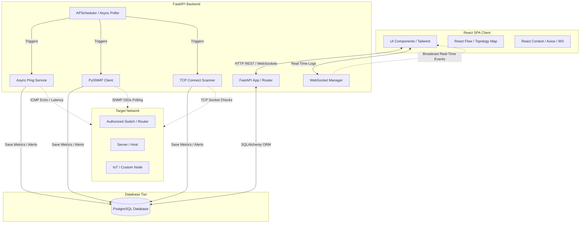
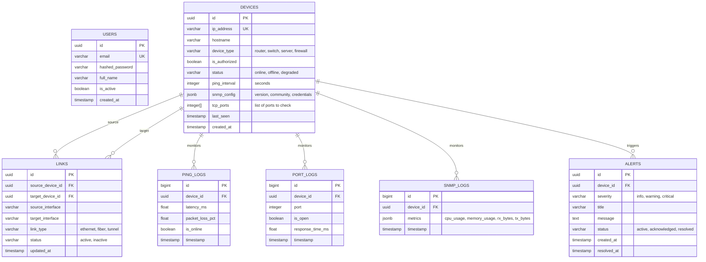
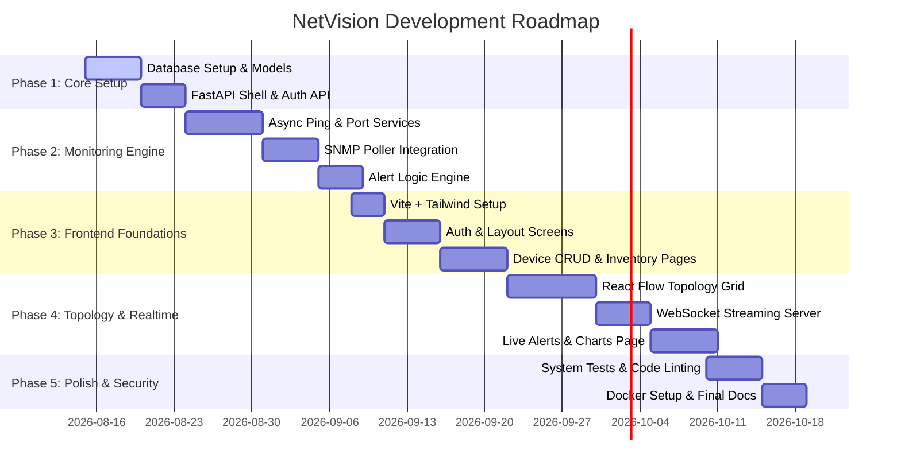

# NetVision: Network Monitoring & Management System
## Software Architecture & System Design Document

This document outlines the complete software architecture, database schema, API contracts, directory structure, and development roadmap for **NetVision**, a web-based Network Monitoring and Management System designed for authorized device tracking, topology visualization, ping/latency monitoring, packet loss calculation, TCP port checking, SNMP polling, and real-time alerting.

---

## 1. High-Level System Architecture

NetVision uses a modern three-tier architecture designed for low latency, scalability, and asynchronous processing. Since network monitoring requires continuous polling without blocking user interactions, the backend separates the **API Server** from the **Background Monitoring Worker**.



### Key Architectural Choices
*   **Frontend (React + Tailwind CSS)**: Employs a component-driven dashboard layout. Includes interactive topological maps utilizing `reactflow` (or `vis-network`) and real-time visualization of latency history using `recharts`.
*   **Backend (FastAPI)**: Leveraging Python's `asyncio` for non-blocking I/O operations, which is critical when pinging or checking ports across hundreds of devices concurrently.
*   **Asynchronous Monitoring Engine**: Utilizes `asyncio.gather` and an async event loop (managed via `APScheduler` or native `asyncio` background tasks) to perform network health checks at scheduled intervals (e.g., every 30 seconds).
*   **Database (PostgreSQL)**: Serves as the persistent store for device metadata, network topology links, health metrics history, and alerts.
*   **Real-time Communication**: Uses **WebSockets** to stream live ping/latency ticks and active alert events directly to the frontend.

---

## 2. Directory Structure

NetVision is organized as a monorepo containing distinct `/backend` and `/frontend` directories, promoting separation of concerns while keeping the codebase unified.

```text
netvision/
├── backend/
│   ├── app/
│   │   ├── api/
│   │   │   ├── v1/
│   │   │   │   ├── endpoints/
│   │   │   │   │   ├── auth.py         # User authentication & registration
│   │   │   │   │   ├── devices.py      # Device inventory & configuration
│   │   │   │   │   ├── topology.py     # Nodes & links topology operations
│   │   │   │   │   ├── metrics.py      # Historical ping/SNMP metrics querying
│   │   │   │   │   ├── alerts.py       # Alert listing & acknowledgment
│   │   │   │   │   └── websockets.py   # WebSocket endpoint for real-time dashboard
│   │   │   │   └── api.py              # APIRouter aggregation
│   │   │   └── deps.py                 # FastAPI dependency injection (DB, auth)
│   │   ├── core/
│   │   │   ├── config.py               # Env vars, app settings, threshold configs
│   │   │   ├── security.py             # JWT token handling, hashing
│   │   │   └── database.py             # Database session manager (SQLAlchemy)
│   │   ├── models/                     # SQLAlchemy DB Models
│   │   │   ├── user.py
│   │   │   ├── device.py
│   │   │   ├── link.py
│   │   │   ├── metric.py               # Latency, packet loss, SNMP logs
│   │   │   └── alert.py
│   │   ├── schemas/                    # Pydantic schemas (Request/Response validation)
│   │   │   ├── user.py
│   │   │   ├── device.py
│   │   │   ├── link.py
│   │   │   ├── metric.py
│   │   │   └── alert.py
│   │   ├── services/                   # Business logic / Network helpers
│   │   │   ├── ping.py                 # Async ICMP ping utility
│   │   │   ├── snmp.py                 # PySNMP polling interface
│   │   │   ├── ports.py                # Async TCP socket checker
│   │   │   └── websocket_manager.py    # WS client tracking and broadcasting
│   │   ├── tasks/
│   │   │   └── scheduler.py            # Background polling runner (APScheduler)
│   │   └── main.py                     # FastAPI application entry point
│   ├── migrations/                     # Alembic database migration scripts
│   ├── tests/                          # Backend unit & integration tests
│   ├── alembic.ini
│   ├── Dockerfile
│   ├── requirements.txt
│   └── README.md
│
├── frontend/
│   ├── public/
│   ├── src/
│   │   ├── assets/                     # Images, icons, static assets
│   │   ├── components/                 # Reusable UI elements
│   │   │   ├── common/                 # Button, Input, Card, Modal, Dropdown
│   │   │   ├── dashboard/              # Metric Cards, Alert Panel, Live Feed
│   │   │   ├── topology/               # NetworkGraph canvas, NodeDetailSidebar
│   │   │   └── layout/                 # Sidebar, Header, PageWrapper
│   │   ├── context/                    # React Contexts
│   │   │   ├── AuthContext.jsx         # User auth token & profile state
│   │   │   └── SocketContext.jsx       # Global WebSocket event listener
│   │   ├── hooks/                      # Custom hooks (e.g., useDevices, useMetrics)
│   │   ├── pages/                      # View components
│   │   │   ├── Login.jsx
│   │   │   ├── Dashboard.jsx           # Overview & critical alerts
│   │   │   ├── Devices.jsx             # Inventory & CRUD management
│   │   │   ├── Topology.jsx            # Interactive topology map
│   │   │   ├── DeviceDetail.jsx        # Detailed charts, historical graphs
│   │   │   └── Alerts.jsx              # Log of warnings & critical issues
│   │   ├── services/                   # API clients (Axios wrappers)
│   │   │   ├── api.js                  # Axios configuration
│   │   │   ├── auth.js
│   │   │   ├── devices.js
│   │   │   └── alerts.js
│   │   ├── utils/                      # Formatting, math helpers
│   │   ├── App.jsx
│   │   ├── index.css                   # Custom global styling & Tailwind directives
│   │   └── main.jsx
│   ├── package.json
│   ├── postcss.config.js
│   ├── tailwind.config.js
│   ├── vite.config.js
│   └── README.md
│
└── README.md                           # Main repository orchestrator
```

---

## 3. Database Schema

We will use a relational schema in PostgreSQL mapping out system users, authorized devices, physical/logical topology links, historical monitoring logs, and alerts.



### Database Schema DDL (PostgreSQL)

```sql
-- Enable UUID extension
CREATE EXTENSION IF NOT EXISTS "uuid-ossp";

-- 1. Users Table
CREATE TABLE users (
    id UUID PRIMARY KEY DEFAULT uuid_generate_v4(),
    email VARCHAR(255) UNIQUE NOT NULL,
    hashed_password VARCHAR(255) NOT NULL,
    full_name VARCHAR(255),
    is_active BOOLEAN DEFAULT TRUE,
    created_at TIMESTAMP WITH TIME ZONE DEFAULT CURRENT_TIMESTAMP
);

-- 2. Devices Table
CREATE TABLE devices (
    id UUID PRIMARY KEY DEFAULT uuid_generate_v4(),
    ip_address VARCHAR(45) UNIQUE NOT NULL, -- Supports IPv4 and IPv6
    hostname VARCHAR(255) NOT NULL,
    device_type VARCHAR(50) DEFAULT 'server', -- router, switch, server, firewall, iot
    is_authorized BOOLEAN DEFAULT FALSE,
    status VARCHAR(20) DEFAULT 'offline', -- online, offline, degraded
    ping_interval INTEGER DEFAULT 30, -- default polling interval in seconds
    snmp_config JSONB DEFAULT '{}'::jsonb, -- e.g., {"version": "v2c", "community": "public", "port": 161}
    tcp_ports INTEGER[] DEFAULT '{}'::INTEGER[], -- array of ports, e.g., {22, 80, 443}
    last_seen TIMESTAMP WITH TIME ZONE,
    created_at TIMESTAMP WITH TIME ZONE DEFAULT CURRENT_TIMESTAMP
);

-- 3. Topology Links Table
CREATE TABLE links (
    id UUID PRIMARY KEY DEFAULT uuid_generate_v4(),
    source_device_id UUID NOT NULL REFERENCES devices(id) ON DELETE CASCADE,
    target_device_id UUID NOT NULL REFERENCES devices(id) ON DELETE CASCADE,
    source_interface VARCHAR(100),
    target_interface VARCHAR(100),
    link_type VARCHAR(50) DEFAULT 'ethernet',
    status VARCHAR(20) DEFAULT 'active',
    updated_at TIMESTAMP WITH TIME ZONE DEFAULT CURRENT_TIMESTAMP
);

-- 4. Ping Logs Table (Time-Series Metric)
CREATE TABLE ping_logs (
    id BIGSERIAL PRIMARY KEY,
    device_id UUID NOT NULL REFERENCES devices(id) ON DELETE CASCADE,
    latency_ms REAL,
    packet_loss_pct REAL NOT NULL,
    is_online BOOLEAN NOT NULL,
    timestamp TIMESTAMP WITH TIME ZONE DEFAULT CURRENT_TIMESTAMP
);
CREATE INDEX idx_ping_logs_device_timestamp ON ping_logs(device_id, timestamp DESC);

-- 5. Port Logs Table (Time-Series Metric)
CREATE TABLE port_logs (
    id BIGSERIAL PRIMARY KEY,
    device_id UUID NOT NULL REFERENCES devices(id) ON DELETE CASCADE,
    port INTEGER NOT NULL,
    is_open BOOLEAN NOT NULL,
    response_time_ms REAL,
    timestamp TIMESTAMP WITH TIME ZONE DEFAULT CURRENT_TIMESTAMP
);
CREATE INDEX idx_port_logs_device_timestamp ON port_logs(device_id, timestamp DESC);

-- 6. SNMP Logs Table (Time-Series Metric)
CREATE TABLE snmp_logs (
    id BIGSERIAL PRIMARY KEY,
    device_id UUID NOT NULL REFERENCES devices(id) ON DELETE CASCADE,
    metrics JSONB NOT NULL, -- e.g., {"cpu_util": 45.2, "mem_util": 68.1, "uptime": 86400, "interfaces": [{"name": "eth0", "in_octets": 1024, "out_octets": 512}]}
    timestamp TIMESTAMP WITH TIME ZONE DEFAULT CURRENT_TIMESTAMP
);
CREATE INDEX idx_snmp_logs_device_timestamp ON snmp_logs(device_id, timestamp DESC);

-- 7. Alerts Table
CREATE TABLE alerts (
    id UUID PRIMARY KEY DEFAULT uuid_generate_v4(),
    device_id UUID NOT NULL REFERENCES devices(id) ON DELETE CASCADE,
    severity VARCHAR(20) NOT NULL, -- info, warning, critical
    title VARCHAR(255) NOT NULL,
    message TEXT NOT NULL,
    status VARCHAR(20) DEFAULT 'active', -- active, acknowledged, resolved
    created_at TIMESTAMP WITH TIME ZONE DEFAULT CURRENT_TIMESTAMP,
    resolved_at TIMESTAMP WITH TIME ZONE
);
CREATE INDEX idx_alerts_status ON alerts(status);
```

---

## 4. API Endpoints Contract

The backend exposes a secure REST API (JWT Authenticated) and a WebSocket portal for streaming real-time statistics. All requests and responses are standard JSON.

### Authentication Endpoints
*   `POST /api/v1/auth/register` - Create administrative account.
*   `POST /api/v1/auth/token` - Authenticate admin & return JWT Token.
*   `GET /api/v1/auth/me` - Retrieve current admin profile details.

### Device Management Endpoints
*   `GET /api/v1/devices` - List all devices (filterable by status, authorization status).
*   `POST /api/v1/devices` - Add a new device.
*   `GET /api/v1/devices/{id}` - Fetch single device config and current status.
*   `PUT /api/v1/devices/{id}` - Update device properties (authorization, credentials, intervals, SNMP config).
*   `DELETE /api/v1/devices/{id}` - Delete device (cascades links and logs).

### Topology Endpoints
*   `GET /api/v1/topology` - Returns graph nodes (devices) and edges (links).
*   `POST /api/v1/topology/links` - Create a physical or logical link between two nodes.
*   `DELETE /api/v1/topology/links/{id}` - Remove a network topology link.

### Metrics Endpoints
*   `GET /api/v1/metrics/ping/{device_id}` - Query historical latency/packet loss logs (supports parameters: `time_range` like `1h`, `24h`, `7d`).
*   `GET /api/v1/metrics/snmp/{device_id}` - Retrieve SNMP history (CPU, memory, interface rates).
*   `GET /api/v1/metrics/ports/{device_id}` - Retrieve historical open/closed status for configured ports.

### Alert Management Endpoints
*   `GET /api/v1/alerts` - List active alerts, sorted by severity and timestamp.
*   `PUT /api/v1/alerts/{id}/acknowledge` - Update alert status to `acknowledged`.
*   `PUT /api/v1/alerts/{id}/resolve` - Manually mark an alert as `resolved`.

### WebSocket Endpoint
*   `WS /api/v1/websockets/live` - Establishes real-time connection. Broadcasts messages when:
    *   A device changes state (`online` -> `offline`).
    *   A background job logs a new latency result.
    *   A threshold is exceeded, triggering a new `alert` record.

#### Example WebSocket Payload (Status Broadcast):
```json
{
  "event": "device_update",
  "data": {
    "device_id": "8f2d5e7a-9c6b-4e1b-bd8c-2f78b1f5d6a2",
    "hostname": "core-switch-01",
    "ip_address": "192.168.1.1",
    "status": "degraded",
    "metrics": {
      "latency_ms": 125.4,
      "packet_loss_pct": 5.0,
      "is_online": true
    }
  }
}
```

---

## 5. Background Monitoring Engine Design

The FastAPI application boots up an async service loop using `APScheduler` or native `asyncio.create_task` loop. 

### Worker Architecture Core Actions:
1.  **Device Registry Lookup**: Fetch all devices where `is_authorized = true`.
2.  **Ping Runner (`aioping` / subprocess)**: 
    *   Executes asynchronous pings. 
    *   Calculates latency (average response time) and packet loss (e.g., sending 5 quick packets and counting timeouts).
3.  **Port Scan Runner**: 
    *   Iterates over the `tcp_ports` array (e.g. `[22, 80, 443]`).
    *   Uses `asyncio.open_connection(ip, port, limit=timeout)` to test connection speeds without blocking.
4.  **SNMP Poller (`pysnmp` / `aiosnmp`)**:
    *   If device SNMP configuration is present, triggers async SNMP GET requests for core OIDs:
        *   **Uptime**: `1.3.6.1.2.1.1.3.0`
        *   **CPU Utilization**: `1.3.6.1.4.1.9.9.109.1.1.1.1.3` (Cisco) / standard MIB equivalents
        *   **RAM Utilization**: `1.3.6.1.4.1.9.9.48.1.1.1.5`
        *   **Interface octets**: `1.3.6.1.2.1.2.2.1.10` (InBound Octets), `1.3.6.1.2.1.2.2.1.16` (OutBound Octets)
5.  **Alert Engine Validation**:
    *   If packet loss exceeds **10%** -> Generate `warning` alert.
    *   If latency exceeds **200ms** -> Generate `warning` alert.
    *   If device `is_online` becomes `false` -> Generate `critical` alert ("Device Offline").
    *   If a previously offline device returns a successful ping -> Auto-resolve matching active alerts and notify via WebSockets.
6.  **Persistence**: Save all results into `ping_logs`, `port_logs`, and `snmp_logs` in batches.

---

## 6. Frontend Dashboard & Topology Architecture

The React client will be responsive, responsive, dark-mode focused, utilizing a glassmorphic aesthetic built with Tailwind CSS.

### Page Components Details:
1.  **Dashboard Hub**: 
    *   Shows overall network health counters (e.g., "94/96 Devices Online", "2 Active Warnings", "1 Critical Outage").
    *   Maintains a scrolling feed of the latest alerts.
    *   Provides high-level line graphs of global latency averages over time.
2.  **Topology Visualizer**:
    *   Uses `reactflow` to render device icons (Switches, Routers, Servers) dynamically positioned.
    *   Connecting lines are color-coded based on link health (Green = Active/Healthy, Red = Failure, Grey = Inactive).
    *   Clicking a device node pulls out a slide-over panel displaying real-time metrics, active ports, and configuration options.
3.  **Device Manager**:
    *   Table listing all authorized/unauthorized devices.
    *   Modal triggers for editing IP addresses, configuring SNMP credentials, choosing ports to scan, and changing authorization status.
4.  **Alert Monitor**:
    *   Filterable log where administrators can acknowledge or close network alert statuses.

---

## 7. Development Roadmap



### Phase Details

#### Phase 1: Foundation & API (Estimated: 9 days)
*   **Deliverables**: Database migrations configured (Alembic), SQLAlchemy models created, and base FastAPI authentication system functional.
*   **Validation**: Verify `/api/v1/auth/token` accepts admin sign-in and endpoints reject requests without correct authorization headers.

#### Phase 2: Async Monitoring Core (Estimated: 16 days)
*   **Deliverables**: Non-blocking background poller service using `asyncio` task scheduling. Checks ping states, queries SNMP values, and connects to target TCP ports. Saves historical tables.
*   **Validation**: Log metrics data to PostgreSQL database in real-time, verifying latency and packet loss logic accurately updates the device status values.

#### Phase 3: Frontend Panels & Device Management (Estimated: 14 days)
*   **Deliverables**: Web structure constructed in React. Auth forms, general layouts, lists of target IPs, and CRUD modals completed.
*   **Validation**: Add, edit, approve, and delete devices from the UI, matching state cleanly on backend databases.

#### Phase 4: Interactive Maps & Live Streaming (Estimated: 19 days)
*   **Deliverables**: React Flow canvas rendering interactive nodes. Real-time updates delivered over a WebSocket server when pings fail or status triggers changes.
*   **Validation**: Simulate network failure (e.g., mock device status change) and check if the topology edge changes color instantly without a page refresh.

#### Phase 5: Security & Deployment Container (Estimated: 9 days)
*   **Deliverables**: Build optimization, Docker Compose files for FastAPI, React, and PostgreSQL, and finalize user configuration documents.
*   **Validation**: `docker-compose up` launches the entire three-tier stack on local host with complete monitoring functions.
